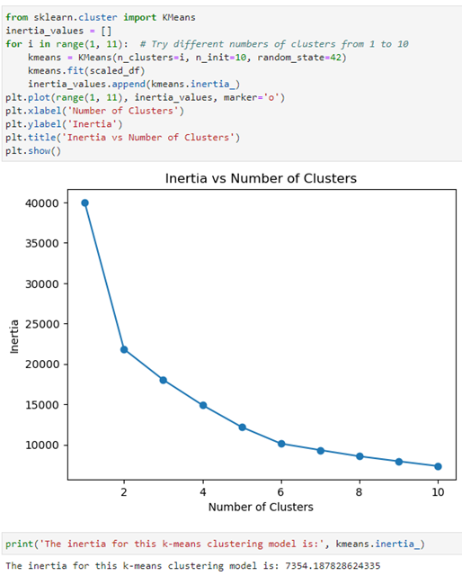
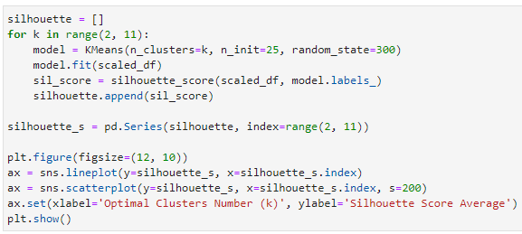
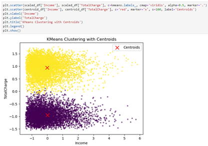
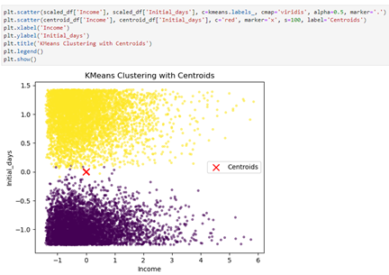
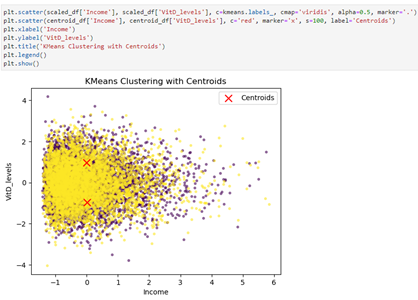

# KMEANS Clustering on Medical Data

# K-Means Clustering Analysis (Medical Dataset)

## Overview
This project applies K-means clustering to a medical dataset to identify patterns and group similar observations based on shared characteristics.

---

## Objective
- Identify natural groupings within the dataset  
- Determine the optimal number of clusters  
- Interpret cluster characteristics to uncover meaningful patterns  

---

## Tools Used
- Python (Pandas, scikit-learn)
- K-means clustering algorithm
- Data visualization techniques  

---

## Determining Optimal Clusters

### Elbow Method

The elbow method was used to evaluate inertia across different cluster values to determine the optimal number of clusters.

---

### Silhouette Score

Silhouette scores were used to assess how well-separated the clusters are, supporting the selection of the optimal cluster number.

---

## Cluster Visualization

The final clustering model groups observations into distinct clusters based on feature similarity.

---

## Key Insights

- The dataset can be segmented into distinct groups with meaningful differences  
- Cluster separation indicates identifiable patterns within the data  
- These groupings could support targeted analysis or decision-making  

---

## Applications

This type of clustering can be used for:
- Patient segmentation  
- Risk stratification  
- Identifying patterns in health data  

---

## Files Included

- `project-summary.docx` → Full written analysis  
- `images/` → Visual outputs from clustering process  

---

## What I Would Do Next

- Standardize features to improve clustering performance  
- Explore additional clustering methods (hierarchical, DBSCAN)  
- Validate clusters with domain-specific interpretation  
