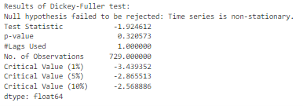
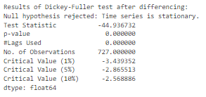
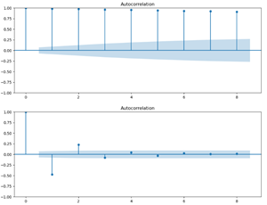
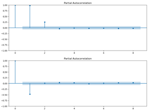
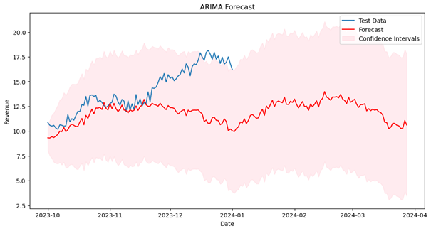

# Time Series Forecasting (ARIMA Model)

## Overview
This project applies time series analysis techniques to forecast revenue trends over time. Using ARIMA modeling, the analysis identifies patterns such as trend and seasonality to generate predictions that can support data-driven business decisions.

---

## Objective
- Analyze historical revenue data for patterns and trends  
- Determine whether the data is stationary  
- Build a forecasting model using ARIMA  
- Generate future revenue predictions  

---

## Tools & Technologies
- Python  
- Pandas, NumPy  
- statsmodels  
- Matplotlib, Seaborn  

---

## Data Preparation
- Converted date fields into time series format  
- Sorted data chronologically  
- Checked for missing values  
- Visualized the time series to identify trends and patterns  

---

## Methodology

### Stationarity Testing
The Augmented Dickey-Fuller (ADF) test was used to determine whether the time series was stationary.

The results indicated that differencing was required to stabilize the mean and variance.

---

### Differencing
Differencing was applied to remove trends and achieve stationarity.

---

### ACF and PACF Analysis
Autocorrelation (ACF) and Partial Autocorrelation (PACF) plots were used to determine appropriate ARIMA parameters.

---

### ARIMA Model
An ARIMA model was selected based on observed patterns in ACF and PACF plots.

The model was trained on historical data to forecast future revenue values.

---

## Forecast Results

The model successfully captures overall trends and produces future revenue predictions.

---

## Key Insights

- Revenue exhibits identifiable trends over time  
- Differencing was necessary to achieve stationarity  
- ARIMA modeling effectively captured temporal patterns  
- Forecasts provide a reasonable estimate of future performance  

---

## Business Relevance

Time series forecasting can help organizations:

- Predict future revenue and plan budgets  
- Identify seasonal trends and demand patterns  
- Support strategic planning and resource allocation  
- Improve financial decision-making  

---

## Limitations

- Forecast accuracy depends on historical data quality  
- ARIMA assumes linear relationships in the data  
- Sudden external changes (market shifts, events) are not captured  

---

## Future Improvements

- Incorporate seasonal ARIMA (SARIMA) if seasonality is present  
- Include external variables (economic indicators, promotions)  
- Compare with machine learning models for forecasting  

---

## Project Files

- `project-summary.docx` or `.pdf` → Full written analysis  
- `images/` → Visualizations (ADF test, ACF/PACF, forecast plots)  

---

## 🧠 Key Takeaway

This project demonstrates how time series modeling can transform historical data into actionable forecasts, enabling organizations to make proactive, data-driven decisions.
